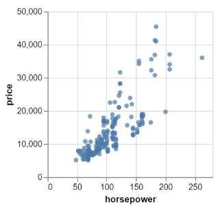
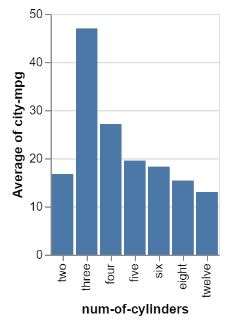
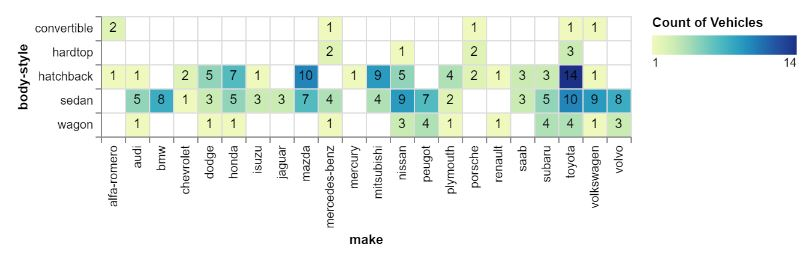

# Vegalite Practice

## Quantitative vs. Quantitative

### Scatter Plot: (Price vs. Horsepower)

## Categorical vs. Quantitative

### Bar Chart: (Number of Cylinders vs. Average of City Miles per Gallon)

## Categorical vs. Categorical

### Labeled Heat Map: (Body Style vs. Manufacturer (make))

